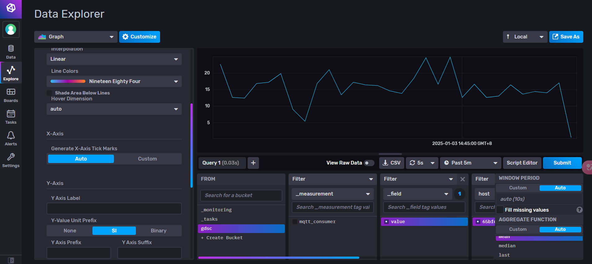

# InfluxDB-IoT-Playground

> Data Analyze for IoT Device

> Author : FKT

---

## Prerequisite

- Docker/Docker-Compose
- Python
- Poetry

---

## Getting Start

### Step.1 setup InfluxDB/Telegraf/Grafana

### Step.2 Get InfluxDB Token

### Step.3 Create Telegraf.conf

### Step.4 Grafana connect to InfluxDB(V2)

### Step.5 Setup MQTT Client(Python)