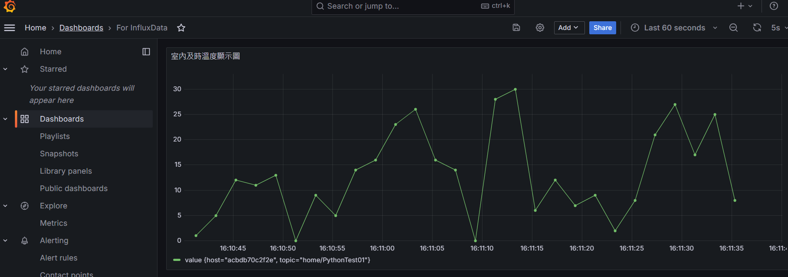
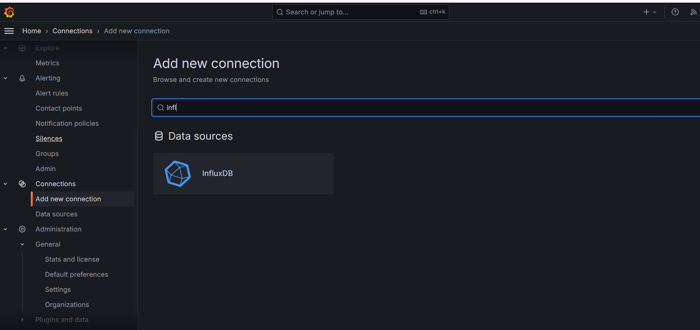
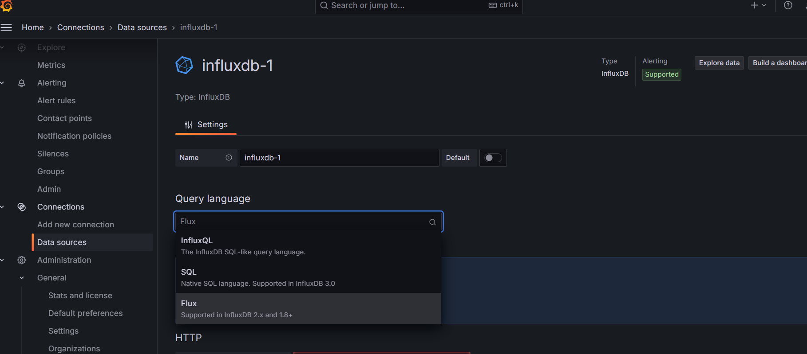
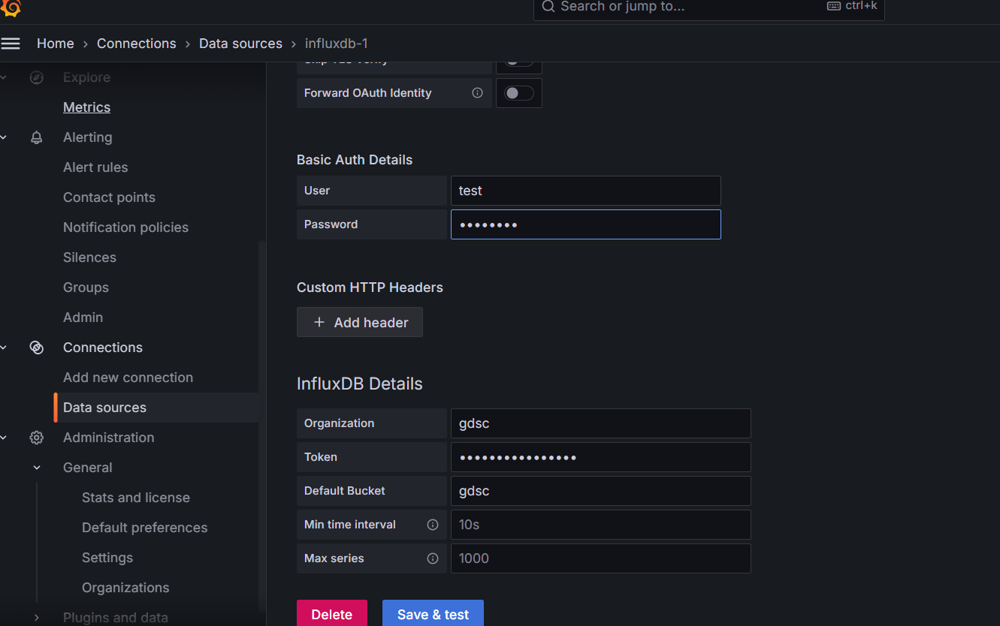
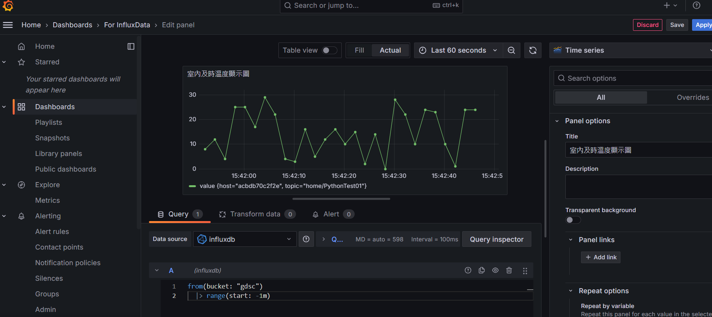

# InfluxDB-IoT-Playground

> Data Analyze for IoT Device

> Author : FKT

---




## System Architecture


---

## Prerequisite

- Docker/Docker-Compose
- Python
- Poetry


---

## Getting Start

### Step.1 setup InfluxDB/Telegraf/Grafana

```shell
docker-compose up -d
```

### Step.2 Get InfluxDB Token

進到 InfluxDB 網頁介面，取得 Token

### Step.3 Create telegraf.conf

創建 telegraf.conf，內容複製來自 *telegraf.conf.example* 的內容，並且把剛剛的 Token 替換掉

### Step.4 Grafana connect to InfluxDB(V2)

開啟 Grafana 介面 > Connections > Add new connection > InfluxDB



記得選擇 InfluxDB 2.0 以上的 **Flux** Source



填入
1. user
2. password
3. bucket
4. organization
5. token



確認與驗證

### Step.5 Setup MQTT Client(Python)

```shell
poetry install
poetry shell
python3 main.py
```

### Step.6 Grafana Query 

填寫至 Dashboard 下方的 Query

```txt
from(bucket: "gdsc")
  |> range(start: -1m)  
```


---

## Note

### Export poetry dependencies to requirements.txt

```shell
poetry export --without-hashes --format=requirements.txt > requirements.txt
```