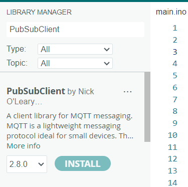

# Arduino D1 mini README

---

> 如果你手上沒有辦法處理 D1 mini 的環境，請參考這篇

- [環境建置](https://ahan3312.blogspot.com/2019/04/wifi-wemos-d1-mini.html)\

## CH341 Download

[CH341 下載地點](https://www.wch.cn/downloads/CH341SER_EXE.html)

## 額外函式庫

### PubSubClient

透過 IDE 下載

手動下載 方式

[請參考這篇文章](https://blog.csdn.net/qcmyqcmy/article/details/125326093)
[Zip 下載連結](https://docs.arduino.cc/libraries/pubsubclient/#Releases)